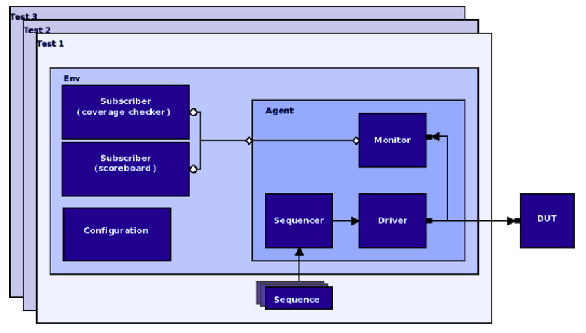

# UVM
UVM testbench for a FIFO block

## About

UVM testbench for a FIFO block. First the testbench is used with a fully functioning FIFO to verify it does not produce false positives. Then the testbench is used to catch errors in FIFOs (fifo1 and fifo2) not working according to the specification.

## How to run

Use these commands (modify the parameters as needed) to run your tests and to save your testbench output to files:

- make (compile and run)
- make gui (compiles, runs and opens the simulator GUI)
- make clean (clean generated files)
- make coverage (generate coverage reports)
- make [+UVM_TESTNAME=random_test] DUT=../rtl/fifo1.vhd |tee fifo1.log (modify the parameters as needed to run your tests and to save your testbench output to files, verbosity level can be altered too)
